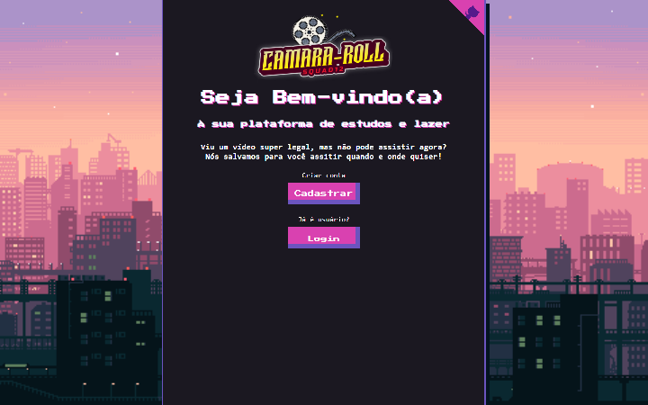

<h1 align="center">
  <a href="https://ffsf-filho.github.io/squad12/">CamaraRoll</a>
</h1>
<h2 align="center">Programa de Formação & Imersão Dev Alura</h2>



Content
=================
   * [About](#About)
   * [Technologies](#Technologies)
   * [Downloading](#Downloading)
   * [StartingTheApplication](#Starting)

<div id="About">    

## About
### This is a project done by @ ffsf-filho, @gabrielasertori, @lucasnsouza, 
### @marcelonader and @LuizGVM for the Dev Alura Training & Immersion Program, sponsored by (FCamara)
### The project is a repository of films and study videos

</div>

<div id="Downloading">

## Downloading
<strong><a href="https://github.com/ffsf-filho/squad12/archive/main.zip"></a>Download ZIP</strong>

<strong>OR</strong>

```
git clone  https://github.com/ffsf-filho/squad12
```

</div>

<div id="Technologies">

## Technologies

  <code>
    
  </code>
  <code>
    
  </code>
  <code>
    
  </code>
  <code>
    
    <imge>
  </code>
</div>

<div id="Starting">

## Starting
``` 

```
OR
``` 

```
</div>

### Features

- [x] Homepage
- [x] Login
- [x] Cadastro Login
- [x] Endpoint of outsystem Rest API
- [x] Tela de Features de Estudo
- [x] Tela de Features de Lazer  

### Autores
---
<table>
  <tr>
      <td>
        <a href="https://github.com/ffsf-filho">
          
          <br />
          <sub>
            <b>Francisco F S Filho</b>
          </sub>
        </a>
      </td>
      <td>
        <a href="https://github.com/gabrielasertori">
          
          <br />
          <sub>
            <b>Gabriela Costa Sertori</b>
          </sub>
        </a>
     </td>
     <td>
        <a href="https://github.com/lucasnsouza">
          
          <br />
          <sub>
            <b>Lucas Souza</b>
          </sub>
        </a>
     </td>
     <td>
        <a href="https://github.com/marcelonader">
          
          <br />
          <sub>
            <b>Marcelo Nader</b>
          </sub>
        </a>
     </td>
     <td>
        <a href="https://github.com/LuizGVM">
          
          <br />
          <sub>
            <b>Luiz G. V. M.</b>
          </sub>
        </a>
     </td>
  </tr>
</table>
